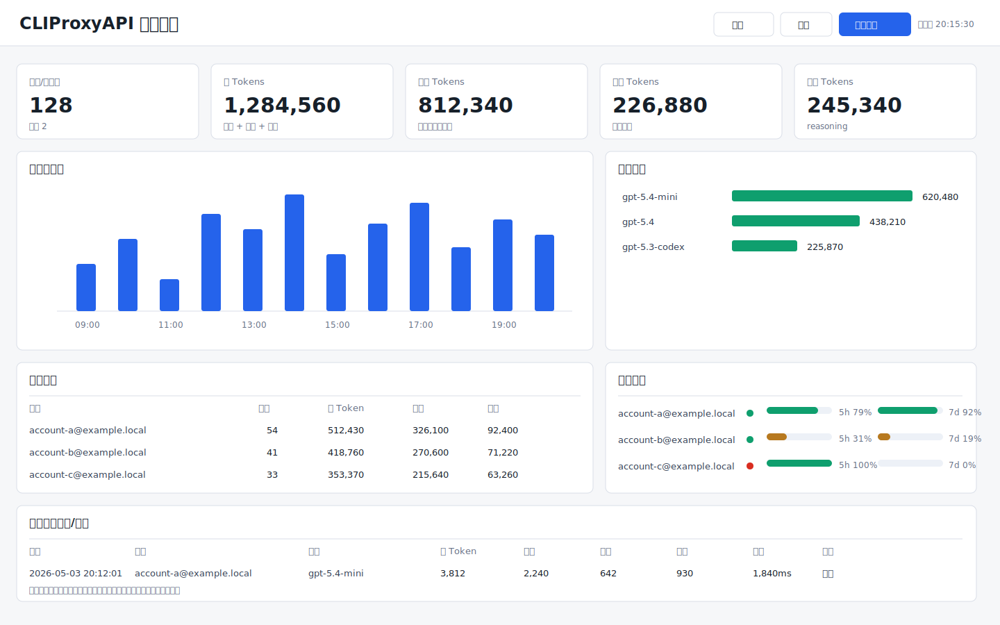
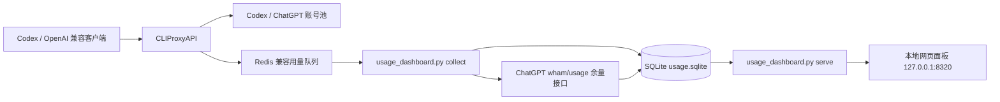
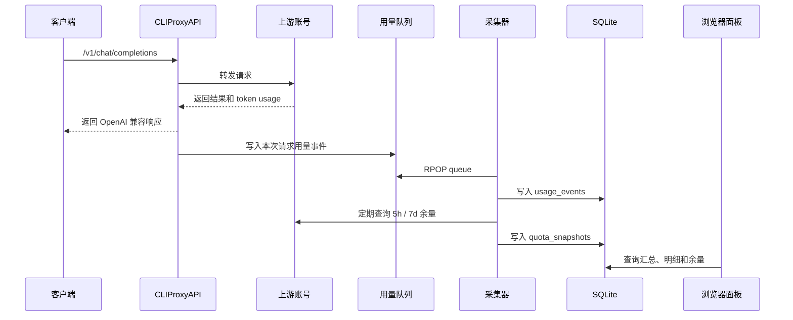

# CLIProxyAPI 用量统计面板

这是一个面向 [CLIProxyAPI](https://github.com/router-for-me/CLIProxyAPI) 的本地用量统计和可视化面板。

它会持续从 CLIProxyAPI 的 Redis 兼容用量队列中采集每次请求记录，写入本地 SQLite，并通过网页展示：

- 每次任务/请求的 token 消耗
- 今日总消耗
- 最近 1 小时、5 小时、24 小时、7 天消耗
- 按账号统计的请求数、token 消耗和失败数
- 按模型统计的 token 消耗
- Codex / ChatGPT 账号的 5 小时与 7 天余量

默认只监听 `127.0.0.1`，适合放在个人电脑或本地开发机上使用。

## 面板预览



上图是脱敏预览图，使用模拟账号和模拟数值，不包含真实邮箱、真实 token、真实密钥或真实用量数据。

## 设计目标

这个项目解决三个问题：

1. CLIProxyAPI 可以代理多个 Codex / GPT 账号，但日常使用时不容易看清每个账号实际消耗了多少。
2. ChatGPT / Codex 账号有 5 小时和 7 天窗口限制，需要一个聚合视图快速判断哪个账号还能用。
3. CLIProxyAPI 的用量队列是短期队列，适合实时消费，不适合长期统计；因此需要落库保存。

本项目的设计原则：

- **本地优先**：所有用量数据保存在本机 SQLite，不上传到第三方服务。
- **最小依赖**：只依赖 Python 标准库，不需要安装 Redis 客户端或 Web 框架。
- **脱敏发布**：仓库只包含源码、模板和说明，不包含 API key、OAuth token、数据库或日志。
- **可长期运行**：提供 macOS LaunchAgent 模板，采集器和面板可以开机自启。

## 架构图



## 数据流



## 统计逻辑

### 每次请求

采集器会把 CLIProxyAPI 队列里的每条事件写入 `usage_events` 表，核心字段包括：

- 时间：`timestamp`、`local_date`、`local_hour`
- 账号：`source`、`auth_index`
- 模型：`model`
- 接口：`endpoint`
- 状态：`failed`
- 耗时：`latency_ms`
- token：`input_tokens`、`output_tokens`、`reasoning_tokens`、`cached_tokens`、`total_tokens`

### 时间窗口

网页面板支持以下窗口：

- 今天：从本地时区当天 00:00 开始
- 最近 1 小时
- 最近 5 小时
- 最近 24 小时
- 最近 7 天

### 账号余量

采集器会定期读取本地 Codex OAuth 文件中的 access token，并查询 ChatGPT 后端的 `wham/usage` 接口，保存每个账号的：

- 账号是否可用
- 5 小时窗口已用百分比和剩余百分比
- 7 天窗口已用百分比和剩余百分比
- 对应窗口的重置时间
- credits balance

## 前置条件

- Python 3.9+
- 已安装并运行 CLIProxyAPI
- CLIProxyAPI Management API 已启用
- CLIProxyAPI 用量统计已启用

建议在 CLIProxyAPI 配置中启用：

```yaml
usage-statistics-enabled: true
redis-usage-queue-retention-seconds: 3600
```

`redis-usage-queue-retention-seconds` 用于延长队列保留时间，避免采集器短暂停止时丢失事件。

## 安装

```bash
mkdir -p ~/.cli-proxy-api/usage-dashboard
cp usage_dashboard.py ~/.cli-proxy-api/usage-dashboard/
cp config.example.json ~/.cli-proxy-api/usage-dashboard/config.json
chmod 700 ~/.cli-proxy-api/usage-dashboard
chmod 600 ~/.cli-proxy-api/usage-dashboard/config.json
```

编辑：

```bash
~/.cli-proxy-api/usage-dashboard/config.json
```

填入你的 CLIProxyAPI Management API 明文密钥：

```json
{
  "cliproxy_host": "127.0.0.1",
  "cliproxy_port": 8317,
  "management_key": "replace-with-your-management-key",
  "poll_interval_seconds": 2,
  "quota_refresh_seconds": 300,
  "dashboard_host": "127.0.0.1",
  "dashboard_port": 8320
}
```

也可以用环境变量覆盖：

```bash
export CLIPROXY_MANAGEMENT_KEY="your-management-key"
```

初始化数据库：

```bash
python3 ~/.cli-proxy-api/usage-dashboard/usage_dashboard.py init
```

## 手动运行

打开第一个终端，启动采集器：

```bash
python3 ~/.cli-proxy-api/usage-dashboard/usage_dashboard.py collect
```

打开第二个终端，启动网页服务：

```bash
python3 ~/.cli-proxy-api/usage-dashboard/usage_dashboard.py serve
```

浏览器访问：

```text
http://127.0.0.1:8320
```

## macOS 后台运行

复制 LaunchAgent 模板：

```bash
mkdir -p ~/Library/LaunchAgents
cp launchd/com.cliproxyapi.usage-collector.plist ~/Library/LaunchAgents/
cp launchd/com.cliproxyapi.usage-dashboard.plist ~/Library/LaunchAgents/
```

把 plist 里的 `/Users/YOUR_USER` 替换成你的真实 home 目录。

加载服务：

```bash
launchctl bootstrap gui/$(id -u) ~/Library/LaunchAgents/com.cliproxyapi.usage-collector.plist
launchctl bootstrap gui/$(id -u) ~/Library/LaunchAgents/com.cliproxyapi.usage-dashboard.plist
```

检查状态：

```bash
launchctl print gui/$(id -u)/com.cliproxyapi.usage-collector
launchctl print gui/$(id -u)/com.cliproxyapi.usage-dashboard
```

卸载服务：

```bash
launchctl bootout gui/$(id -u) ~/Library/LaunchAgents/com.cliproxyapi.usage-collector.plist
launchctl bootout gui/$(id -u) ~/Library/LaunchAgents/com.cliproxyapi.usage-dashboard.plist
```

## 命令行查询

查看今日汇总：

```bash
python3 ~/.cli-proxy-api/usage-dashboard/usage_dashboard.py report today
```

查看最近 5 小时：

```bash
python3 ~/.cli-proxy-api/usage-dashboard/usage_dashboard.py report 5h
```

强制刷新账号余量：

```bash
python3 ~/.cli-proxy-api/usage-dashboard/usage_dashboard.py quota --force
```

## API

网页服务同时提供本地 JSON API：

```text
GET /api/health
GET /api/summary?range=today
GET /api/summary?range=5h
GET /api/quota
GET /api/quota?force=1
GET /api/requests?limit=100
```

`range` 支持：

- `today`
- `1h`
- `5h`
- `24h`
- `7d`

## 数据文件

默认文件位置：

```text
~/.cli-proxy-api/usage-dashboard/config.json
~/.cli-proxy-api/usage-dashboard/usage.sqlite
~/.cli-proxy-api/usage-dashboard/logs/
```

其中：

- `config.json` 包含本地管理密钥，不能提交。
- `usage.sqlite` 包含账号名和用量统计，不能提交。
- `logs/` 可能包含运行错误信息，不能提交。

## 安全与脱敏

仓库不应包含以下内容：

- CLIProxyAPI Management API 明文密钥
- CLIProxyAPI API key
- OAuth `access_token`
- OAuth `refresh_token`
- OAuth `id_token`
- 本地 `config.json`
- SQLite 数据库
- 日志文件
- 真实账号邮箱

本仓库的 `.gitignore` 默认排除：

```text
config.json
*.sqlite
*.sqlite-shm
*.sqlite-wal
logs/
__pycache__/
*.pyc
.DS_Store
```

发布前建议执行：

```bash
git grep -n -I "refresh_token\|id_token\|gho_\|Bearer [A-Za-z0-9]\|chatgpt_account_id"
```

如果命中真实值，不要发布，先清理 git 历史。

## 限制

- 只能统计采集器启动之后的请求，历史数据无法补回。
- CLIProxyAPI 的队列是短期队列，采集器长时间停止会丢失期间事件。
- 账号余量查询依赖 ChatGPT 后端接口，接口变更时可能需要调整。
- 面板默认不做多用户认证，应保持监听 `127.0.0.1`。

## 许可证

MIT
